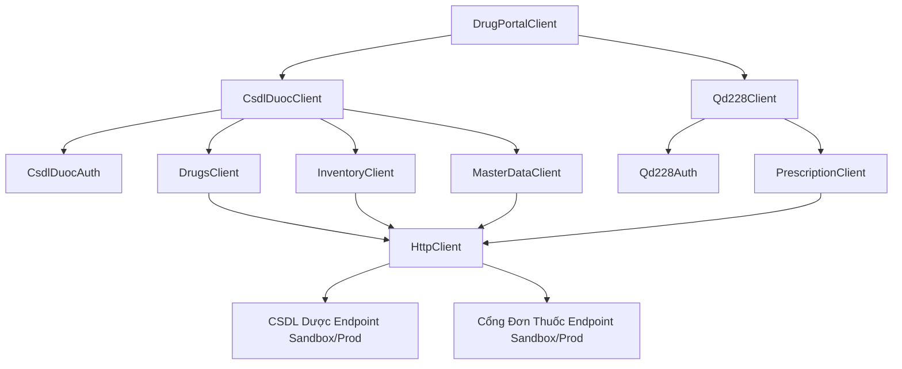

# Project Context: Drug Portal SDK

## 1. Overview & Architecture
The `drug-portal-sdk` (configured as `@icare1/drug-portal-sdk` in `package.json`) is a TypeScript-first SDK that facilitates synchronization and integration with two major Vietnamese pharmaceutical regulatory portals:
1. **CSDL Dược (QĐ 522)**: National Drug Database (Cơ sở dữ liệu Dược Quốc gia).
2. **Cổng Đơn Thuốc (QĐ 228)**: National Prescription Portal (Cổng Đơn thuốc Quốc gia).

This SDK ports features from the Odoo 17 Python module `san_pharmacy_sync` to TypeScript, running on Node.js 18+ with zero runtime dependencies.

### High-Level Architecture Flow



---

## 2. Directory Structure & Details

```
drug-portal-sdk/
├── .github/workflows/
│   └── ci.yml                     # GitHub Actions CI for linting, testing, building and publishing
├── dist/                          # Build output containing CJS, ESM and types (.d.ts)
├── examples/                      # Executable usage scenarios
│   ├── basic-usage.ts             # Core authentication and drug search
│   ├── prescription-lookup.ts     # Prescription querying and sale-qty updating
│   └── stock-in.ts                # Full workflow for inventory stock-in with status polling
├── src/                           # Codebase source code (TypeScript)
│   ├── auth/                      # Authentication handlers
│   │   ├── csdl-duoc-auth.ts      # OAuth2 flow, token cache, and auto-refresh on 401
│   │   └── qd228-auth.ts          # Static headers (app-name/app-key) handler
│   ├── csdl-duoc/                 # QĐ 522 Modules
│   │   ├── drugs.ts               # Drug catalog lookup & detail mapping
│   │   ├── index.ts               # Sub-client aggregator for CSDL Dược
│   │   ├── inventory.ts           # Transactions (stock-in/out/taking) & polling logic
│   │   └── master-data.ts         # Utility category data (units, routes, countries)
│   ├── http/                      # Core HTTP Client
│   │   ├── http-client.ts         # Custom fetch wrapper with token injection & unauthorized handler
│   │   ├── logger.ts              # Structured JSON logging framework
│   │   ├── logging-utils.ts       # Utility methods for log formatting & credential masking
│   │   └── retry.ts               # Exponential backoff retry engine for 429/5xx status codes
│   ├── qd228/                     # QĐ 228 Modules
│   │   ├── index.ts               # Sub-client aggregator for Cổng Đơn Thuốc
│   │   └── prescriptions.ts       # Prescription lookup and sale qty updates (UC05)
│   ├── types/                     # Shared TypeScript interface declarations
│   │   ├── auth.ts
│   │   ├── common.ts
│   │   ├── config.ts
│   │   ├── drugs.ts
│   │   ├── inventory.ts
│   │   └── prescriptions.ts
│   ├── constants.ts               # Shared internal parameters (endpoints, timing, retries)
│   └── index.ts                   # Main entry point exporting DrugPortalClient
├── tests/                         # Test suites
│   ├── helpers/
│   │   └── mock-handlers.ts       # Mock API responses using MSW (Mock Service Worker)
│   ├── unit/                      # Unit tests validating each submodule logic
│   │   ├── client.test.ts
│   │   ├── config.test.ts
│   │   ├── drugs.test.ts
│   │   ├── inventory.test.ts
│   │   ├── logger.test.ts
│   │   ├── logging-utils.test.ts
│   │   ├── prescriptions.test.ts
│   │   └── retry.test.ts
│   └── integration/               # Dedicated directory for real sandbox environment tests
├── package.json                   # Build tools & package metadata configuration
├── tsup.config.ts                 # Bundle compiler configuration (tsup)
└── vitest.config.ts               # Vitest settings
```

---

## 3. Submodule Architectural Deep-Dive

### A. Authentication Module (`src/auth/`)
* **CSDL Dược (`CsdlDuocAuth`)**:
  - Handles token retrieval by POSTing to `/auth/login` (payload: `username` and Base64-encoded `password`).
  - Cache TTL is configurable (default is 24 hours), with auto-refresh starting `5 minutes` prior to expiry.
  - Automatically intercepts `401 Unauthorized` responses, clears the cache, executes a re-login request, and retries the original request once.
  - Exposes `setCachedToken` and `getState` hooks to allow state persistence in databases (avoiding login overhead across restarts).
* **Cổng Đơn Thuốc (`Qd228Auth`)**:
  - Static header builder injecting `app-name` and `app-key` headers for every request.

### B. Core HTTP Module (`src/http/`)
* **`HttpClient`**:
  - Leverages native `fetch` API.
  - Seamlessly integrates the `AuthProvider` to auto-inject header credentials.
  - Retries failed operations up to 3 times (configurable) on `429 (Too Many Requests)` or `5xx` errors.
  - Calculates backoff using: `delay = initialDelay * Math.pow(factor, attempt) + jitter`.
* **Logging System (`StructuredLogger` / `logging-utils`)**:
  - Produces structured JSON logs containing `message`, `timestamp`, `level`, `traceId`, and contextual meta.
  - Auto-masks fields such as `password`, `token`, `access_token`, and `app-key` to prevent accidental leak of credentials.

### C. CSDL Dược Module (`src/csdl-duoc/`)
* **`DrugsClient`**:
  - Implements POS drug catalog search with a fallback to the national master catalog if no matches are found in the POS database.
  - Maps detailed drug structures, wrapping them in clean TypeScript types.
* **`InventoryClient`**:
  - Handles **Stock-In** (nhập kho), **Stock-Out** (xuất kho), and **Stock-Taking** (kiểm kho).
  - Normalizes reason mapping (`StockReasonMapper`) and payload definitions to comply with regulatory standards.
  - Polls transaction outcomes via `pollTransaction` up to **30 times** using variable delays (based on transaction status: shorter delays for `accepted`, longer for `processing`).
* **`MasterDataClient`**:
  - Fetches core registers: route lists, units, manufacturers, active ingredients, and country lists.

### D. Cổng Đơn Thuốc Module (`src/qd228/`)
* **`PrescriptionClient`**:
  - Looks up prescription details by code.
  - Updates the quantity of drugs sold for a prescription (UC05). Re-tries the operation up to 2 times with a 30s delay if the portal fails to process.

---

## 4. Token Caching & Persistence Optimization

On production environments, calling the login API of CSDL Dược (`POST /auth/login`) frequently or on every application restart is inefficient and can trigger rate limits on the regulatory servers.

To optimize authentication performance, the SDK provides features to persist and reuse authentication tokens:

### Token Lifetime and Refresh Logic
- By default, CSDL Dược tokens are valid for **24 hours** (configured via `tokenTtlHours`).
- The SDK monitors token lifetime and automatically refreshes the token `5 minutes` before it expires.
- If a token is rejected by the server with a `401 Unauthorized` error (e.g., if revoked early), the SDK clears the cache, initiates a fresh login, and retries the failed API call once.

### How to Persist Tokens (Best Practice)
Integrators should listen to token changes, store them in a persistent data store (like Redis, PostgreSQL, or MongoDB), and restore them when initializing the SDK client.

#### Example: Integrating Token Persistence with Database/Redis

```typescript
import { DrugPortalClient } from '@icare1/drug-portal-sdk';

// 1. Fetch previously cached token from your database or cache store
const savedSession = await db.query('SELECT token, expires_at FROM auth_tokens WHERE provider = "csdl_duoc"');

const client = new DrugPortalClient({
  environment: 'production',
  csdlDuoc: {
    username: 'your-username',
    password: 'your-password',
  },
  // 2. Restore cached token if it exists
  cachedToken: savedSession?.token,
  cachedTokenExpiresAt: savedSession?.expires_at ? new Date(savedSession.expires_at) : undefined,

  // 3. Listen to token generation/refresh events to update your database
  onTokenChange: async (newToken, expiresAt) => {
    await db.query(
      `INSERT INTO auth_tokens (provider, token, expires_at) 
       VALUES ("csdl_duoc", $1, $2)
       ON CONFLICT (provider) DO UPDATE SET token = $1, expires_at = $2`,
      [newToken, expiresAt]
    );
  }
});
```

---

## 5. Current Verification Status (Vitest + MSW)
- We have **41 mock-based unit tests** covering all endpoints, configurations, retry mechanisms, logging, and auth states.
- Running `npm run test` spins up MSW mock servers to simulate successful runs, error cases, 401 auth failures, and exponential backoff retry triggers.
- **Result**: 41/41 tests passing.

---

## 6. Deployment & Release Roadmap

### Step 1: GitHub & NPM Organization Preparation
- [ ] Ensure you are logged into [npmjs.com](https://www.npmjs.com) and create/configure the scope (currently configured as `@icare1/drug-portal-sdk`, but can be changed back to `@vuduyviet1110/drug-portal-sdk` if published individually).
- [ ] Create an **Automation Access Token** on NPM (Classic Token -> Type: Automation) to bypass 2-Factor Authentication during CI pipeline.
- [ ] Go to GitHub `vuduyviet1110/drug-portal-sdk` -> **Settings** -> **Secrets and variables** -> **Actions** -> Add **New repository secret**:
  - **Name**: `NPM_TOKEN`
  - **Value**: *Paste the copied NPM Access Token*.

### Step 2: Sandbox Credentials Setup & Integration Verification
To perform integration testing on the actual sandbox environment, prepare real API credentials and execute:
```bash
# 1. Build the library
npm run build

# 2. Export sandbox environment variables
export CSDL_DUOC_USERNAME="your_sandbox_username"
export CSDL_DUOC_PASSWORD="your_sandbox_password"
export QD228_APP_NAME="your_qd228_app_name"
export QD228_APP_KEY="your_qd228_app_key"

# 3. Execute basic usage example
npx tsx examples/basic-usage.ts

# 4. Execute inventory stock-in example
npx tsx examples/stock-in.ts
```

### Step 3: Publish package
- **Automatic Publishing**: The CI pipeline in `.github/workflows/ci.yml` is fully automated. Pushing any commit to the `main` branch will automatically run tests, build the code, and publish the new version to NPM (as long as `NPM_TOKEN` is configured).
- **Manual Publishing**: Alternatively, you can publish manually from your terminal:
  ```bash
  npm run build
  npm publish --access public
  ```
